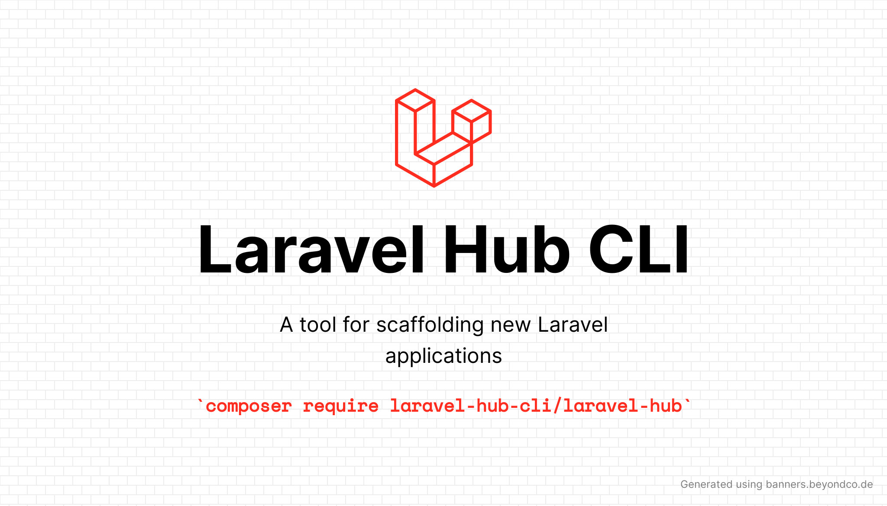

# Installation

```bash
composer global require laravel-hub-cli/laravel-hub
```

# Usage

You can use the CLI as a near drop-in replacement for the offical Laravel installer. For example:

```bash
laravel-hub new project
```

But the real power of the tool is when you create a `compose` file. The `compose` file is your basic recipe for your application. You should create an `app.yaml` file in the directory where you would like to create your application.

```touch
touch app.yaml
```

When you are done crafting your recipe (see docs below), you should run the `compose` command:

```bash
laravel-hub compose {script=app.yaml} {name?} {version?} {--force}
```

# Compose File API

- [env](#env)
- [name](#name)
- [touch](#touch)
- [mkdir](#mkdir)
- [artisan](#artisan)
- [console](#console)
- [version](#version)
- [php-packages](#php-packages)
- [php-packages-dev](#php-packages-dev)
- [npm-packages](#npm-packages)
- [npm-packages-dev](#npm-packages)

## `env`

The `env` API allows you update or insert (upsert) keys in the applications `.env` file.

An example is show below:

```yaml
env:
 APP_NAME: "Laravel"
 DB_DATABASE: "laravel"
 NEW_ENV_KEY: "value"
```

## `name`

- Required: True

The `name` key is required, the sluggified version of the name will be used to generate the folder name where the application will be installed.

## `touch`

The `touch` API allows you create files in your application. Any required directories will also be created.

An example is show below:

```yaml
touch:
  - "app/Support/helpers.php"
```

## `mkdir`

The `mkdir` API allows you create directories in your application. Any required parent directories will also be created.

An example is show below:

```yaml
mkdir:
  - "resources/svg"
```

## `artisan`

The `artisan` API allows you run Laravel Artisan commands in your application.

An example is show below:

```yaml
artisan:
  - storage:link
  - make:model Post -mfc
```

## `console`

The `console` API allows you create run console commands in your application. 

An example is show below:

```yaml
console:
  - git init
  - code .
```

## `version`

The `version` API allows you to declare what version of Laravel you want to install. You can specify any valid composer version.

An example is show below:

```yaml
version: "7.x"
```

## `php-packages`

The `php-packages` API allows you require composer packages into your application.

An example is show below:

```yaml
php-packages:
  - laravel/telescope
  - laravel/socialite
```

## `php-packages-dev`

The `php-packages-dev` API allows you require dev only composer packages into your application.

An example is show below:

```yaml
php-packages-dev:
  - brianium/paratest
```

## `npm-packages`

The `npm-packages` API allows you install NPM packages into your application.

An example is show below:

```yaml
npm-packages:
  - "tailwindcss/@latest"
```

## `npm-packages-dev`

The `npm-packages` API allows you install NPM dev packages into your application.

An example is show below:

```yaml
npm-packages-dev:
  - "alpinejs"
```